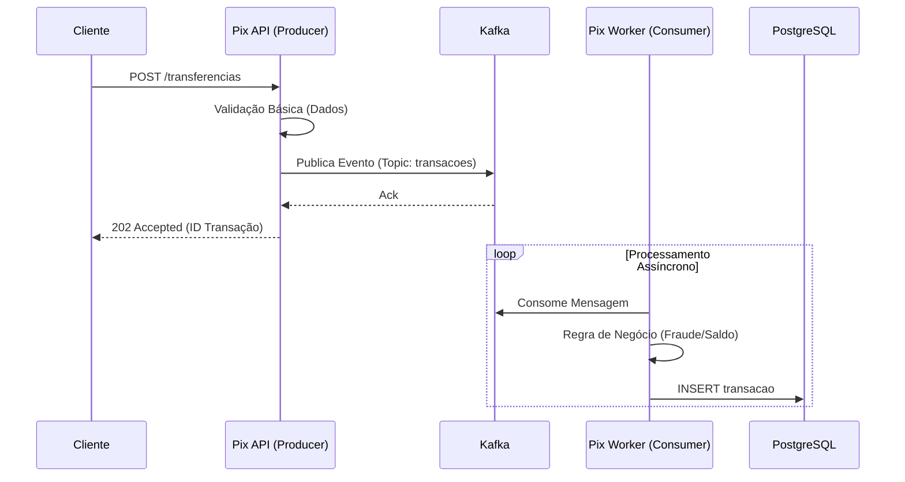

# 🚀 Sistema de Transferências Pix Assíncronas (PoC)

> **Simulação de Arquitetura Event-Driven para Processamento Financeiro**

Este projeto é uma Prova de Conceito (PoC) desenvolvida para demonstrar proficiência em arquitetura de microsserviços, processamento assíncrono e desenvolvimento Cloud Native, alinhado com tecnologias modernas utilizadas no setor bancário.

---

## 🛠️ Stack Tecnológico

A escolha das tecnologias visa performance (tempo de inicialização e memória), robustez e conformidade com padrões de mercado (ex: Banco Inter).

| Categoria | Tecnologia | Justificativa |
| :--- | :--- | :--- |
| **Linguagem** | **Java 21 (LTS)** | Utilização de recursos modernos como *Records* (para DTOs), *Pattern Matching* e *Virtual Threads*. |
| **Framework** | **Micronaut 4.x** | Framework *Cloud Native* com injeção de dependência em tempo de compilação (AOT), garantindo startup rápido e baixo consumo de memória. |
| **Build Tool** | **Maven** | Gerenciamento de dependências e ciclo de vida do build padrão de mercado. |
| **Mensageria** | **Apache Kafka** | Backbone de comunicação assíncrona para garantir desacoplamento e resiliência entre os serviços. |
| **Banco de Dados** | **PostgreSQL** | Banco relacional robusto para garantir a integridade (ACID) das transações financeiras. |
| **Containerização** | **Docker & Compose** | Padronização do ambiente de desenvolvimento e orquestração dos serviços de infraestrutura. |
| **Database Migration** | **Flyway** | Versionamento e automação da evolução do esquema do banco de dados. |
| **Testes** | **JUnit 5 & Testcontainers** | Testes de integração utilizando containers reais (sem mocks de banco) para maior confiabilidade. |

---

## 🏗️ Arquitetura da Solução

O sistema adota uma arquitetura orientada a eventos (EDA) para processar transferências de alto volume sem bloquear a API do cliente.

**Fluxo da Informação:**
1.  **API Gateway (Producer):** Recebe a requisição HTTP REST, valida o payload e publica um evento no tópico Kafka. Retorna `202 Accepted` imediatamente.
2.  **Message Broker (Kafka):** Persiste o evento e garante a entrega para o consumidor.
3.  **Worker (Consumer):** Processa a mensagem em background, executa regras de negócio (fraude/saldo) e persiste o resultado final.

### Diagrama de Sequência (Conceitual)



---

## 📦 Especificação dos Componentes

### 1. Microsserviço: Pix API Gateway (`pix-api`)
**Tipo:** Web Service / Kafka Producer
**Responsabilidade:** Entrada de dados e validação estrutural.

* **Endpoint:** `POST /api/v1/transferencias`
* **Payload (Request):**
    ```json
    {
      "clienteId": "uuid-v4",
      "valor": 100.00,
      "chaveDestino": "email@teste.com"
    }
    ```
* **Comportamento:**
    1.  Valida se `valor > 0` e se `chaveDestino` é válida.
    2.  Gera um `idTransacao` (UUID).
    3.  Envia mensagem para o tópico `transacoes-pix`.
    4.  Retorna HTTP 202 com o `idTransacao`.

### 2. Microsserviço: Pix Processor Worker (`pix-worker`)
**Tipo:** Worker / Kafka Consumer
**Responsabilidade:** Processamento core e persistência.

* **Gatilho:** Listener do tópico `transacoes-pix`.
* **Regras de Negócio:**
    1.  Simula verificação de fraude (ex: Se `valor > 2000`, status = `EM_ANALISE`, senão `APROVADO`).
    2.  Utiliza **Micronaut Data JDBC** para salvar na tabela `transacoes`.
* **Modelo de Dados (Tabela):**
    * `id` (UUID, PK)
    * `cliente_id` (VARCHAR)
    * `valor` (DECIMAL)
    * `status` (VARCHAR)
    * `data_hora` (TIMESTAMP)

---

## ⚙️ Infraestrutura (Docker Compose)

O arquivo `docker-compose.yml` na raiz do projeto orquestra as dependências externas:

1.  **Zookeeper:** Gerenciador do cluster Kafka.
2.  **Kafka Broker:** Porta exposta `9092` (acesso externo) e `29092` (acesso interno dos containers).
3.  **PostgreSQL:** Banco de dados criando automaticamente o database `pixdb`.
4.  **Kafdrop (Opcional):** Interface web para monitoramento dos tópicos na porta `9000`.

---

## 🚀 Como Executar Localmente

### Pré-requisitos
* Java 21 JDK
* Docker & Docker Compose
* Maven 3.8+

### 1. Inicializar Infraestrutura
```bash
docker-compose up -d
```

### 2. Executar microsserviços

Em terminais separados:

```bash
# Terminal 1 (API)
cd pix-api
./mvnw mn:run

# Terminal 2 (Worker)
cd pix-worker
./mvnw mn:run
```

### 3. Testar
```bash
curl -X POST http://localhost:8080/api/v1/transferencias \
   -H "Content-Type: application/json" \
   -d '{"clienteId": "c1", "valor": 500.00, "chaveDestino": "user@inter.com"}'
```

---

Desenvolvido por **Mateus Silva**
